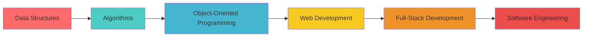

<div align="center">
  
## Zephaniah

[](https://git.io/typing-svg)


</div>

---

<div align="center">

## 🌟 About Me

</div>

```javascript
const zephaniah = {
    pronouns: "He/Him",
    currentStatus: "Level 200 Computer Science Student",
    location: "📍 Ghana",
    currentFocus: ["Data Structures & Algorithms", "Object-Oriented Programming", "Web Development"],
    askMeAbout: ["Programming", "Computer Science", "Problem Solving", "Learning Journey"],
    technologies: {
        languages: ["Python", "Java", "C++", "JavaScript", "HTML5", "CSS3"],
        frameworks: ["React", "Node.js"],
        tools: ["Git", "VS Code", "IntelliJ IDEA", "Linux"],
        databases: ["MySQL"],
        currentlyLearning: ["Full-Stack Development", "Algorithm Optimization"]
    },
    funFact: "I will solve a riddle no matter how long it takes me"
};
```

<div align="center">

## 🛠️ Tech Stack

### 💻 Languages


### 🚀 Frameworks & Libraries


### 🛠️ Tools & Platforms


</div>

---

<div align="center">

## 📊 GitHub Analytics


</div>

<div align="center">

## 🏆 GitHub Trophies


</div>

<div align="center">

## 📈 Contribution Graph
[](https://github.com/ashutosh00710/github-readme-activity-graph)

</div>

---

<div align="center">

## 📚 Current Learning Journey




### 🎯 2025 Goals
- [ ] Master Data Structures & Algorithms
- [ ] Complete 100 LeetCode problems
- [ ] Build 3 full-stack projects
- [ ] Contribute to open source
- [ ] Learn cloud technologies

</div>

---

<div align="center">

## 🌐 Connect With Me

<a href="mailto:your.zephaniahayuah@gmail.com">
    
</a>
<a href="https://www.linkedin.com/in/zephaniah-ayuah-41486a341/">
    


</div>

---

<div align="center">

## 💭 Quote of the Day


</div>


---

<div align="center">


</div>
